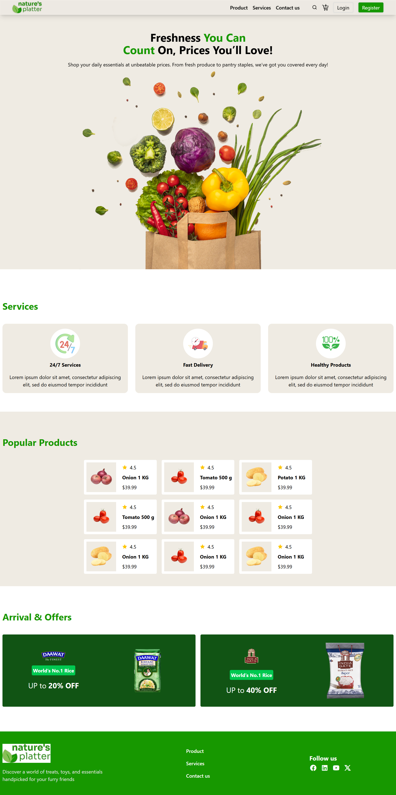
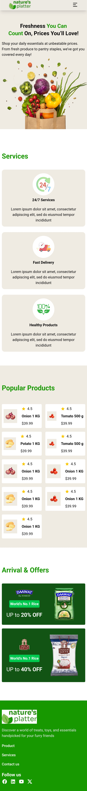

# 🌿 Nature Platter - Freshness You Can Count On

Nature Platter is a modern, clean, and responsive landing page designed for showcasing grocery or organic product services. Built using HTML and Tailwind CSS, it emphasizes usability, mobile-responsiveness, and fresh design aesthetics.

## ✨ Features

- 🛒 Product Listings with ratings and prices
- 📦 Services section highlighting key offerings
- 📱 Fully responsive layout with mobile menu toggle
- 🎨 Stylish and consistent design using Tailwind CSS
- 🔍 Icons and interactivity via Remix Icon and simple JavaScript
- 💬 Footer with social media links and brand message

## 📸 Preview

## 🚀 Technologies Used

- **HTML5**
- **Tailwind CSS**
- **Remix Icon**
- **JavaScript (for mobile menu toggle)**

## How to Run

1. Clone this repository
2. Open `https://github.com/git-ethicks/Nature-s-platter` in your browser
3. Or view live at: [[GitHub Pages Link](https://git-ethicks.github.io/Nature-s-platter/)]

